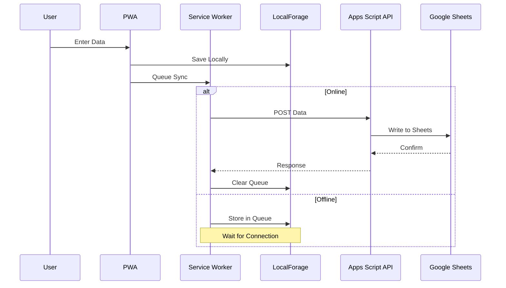

# RLC Bingo Manager

[](https://github.com/wewantthefunk/rlc-bingo-manager/releases)
[](LICENSE)
[](https://developer.mozilla.org/en-US/docs/Web/Progressive_web_apps)
[](https://www.mgc.dps.mo.gov/)

A complete Progressive Web Application (PWA) for managing bingo occasions with offline capabilities, designed specifically for the Rolla Lions Club in compliance with Missouri Gaming Commission regulations.

## 🎯 Features

### Core Functionality
- **📱 Progressive Web App**: Installable on any device, works offline
- **☁️ Cloud Sync**: Automatic bidirectional synchronization with Google Sheets
- **📸 Photo Documentation**: Integrated camera support for winner documentation
- **💰 Financial Tracking**: Complete money counting and deposit reconciliation
- **📊 MGC Compliance**: Built-in Missouri Gaming Commission reporting
- **🔒 Secure Access**: Role-based authentication and audit logging
- **🎮 Session Management**: Predefined game configurations for each Monday
- **🎟️ Pull-Tab Tracking**: Complete inventory and sales management

### Technical Features
- **Offline-First Architecture**: Full functionality without internet connection
- **IndexedDB Storage**: Local data persistence using LocalForage
- **Service Worker**: Background sync and cache management
- **Responsive Design**: Mobile-first, works on all screen sizes
- **Real-time Calculations**: Automatic totals and variance tracking
- **Conflict Resolution**: Smart merge for multi-device edits
- **Data Validation**: Client and server-side validation
- **Audit Trail**: Complete change tracking for compliance

## 🚀 Quick Start

### Prerequisites

- Google Account with Apps Script access
- GitHub Pages enabled (for hosting)
- Modern web browser (Chrome recommended)

### Installation

1. **Clone the Repository**
   ```bash
   git clone https://github.com/wewantthefunk/rlc-bingo-manager.git
   cd rlc-bingo-manager
   ```

2. **Deploy Google Apps Script Backend**
   ```javascript
   // 1. Create new Google Apps Script project
   // 2. Copy all *.gs files from /gas directory
   // 3. Run setup() function
   // 4. Deploy as Web App
   // 5. Copy deployment URL
   ```

3. **Configure Frontend**
   ```javascript
   // Edit js/config.js
   const CONFIG = {
     API_URL: 'YOUR_DEPLOYMENT_URL_HERE',
     // ... other settings
   };
   ```

4. **Deploy to GitHub Pages**
   ```bash
   git add .
   git commit -m "Initial deployment"
   git push origin main
   # Enable GitHub Pages in repository settings
   ```

5. **Access Application**
   ```
   https://[your-username].github.io/rlc-bingo-manager/
   ```

## 🏗️ Architecture

### System Components

```
┌────────────────────────────────────────────┐
│               Frontend (PWA)               │
├────────────────────────────────────────────┤
│  ┌──────────┐  ┌──────────┐  ┌──────────┐  │
│  │   HTML   │  │    CSS   │  │    JS    │  │
│  │  index   │  │   main   │  │   app    │  │
│  │          │  │  mobile  │  │  config  │  │
│  │          │  │  print   │  │  offline │  │
│  └──────────┘  └──────────┘  └──────────┘  │
│                                            │
│  ┌──────────────────────────────────────┐  │
│  │    Service Worker                    │  │
│  │    - Cache Management                │  │
│  │    - Background Sync                 │  │
│  │    - Offline Support                 │  │
│  └──────────────────────────────────────┘  │
│                                            │
│  ┌──────────────────────────────────────┐  │
│  │    LocalForage (IndexedDB)           │  │
│  │    - Local Data Storage              │  │
│  │    - Sync Queue                      │  │
│  │    - Offline Cache                   │  │
│  └──────────────────────────────────────┘  │
└────────────────────────────────────────────┘
                            │
                    RESTful API (HTTPS)
                            │
┌─────────────────────────────────────────────────────────┐
│              Backend (Google Apps Script)               │
├─────────────────────────────────────────────────────────┤
│  ┌───────────────────────────────────────┐              │
│  │            Web App (doGet/doPost)     │              │
│  └───────────────────────────────────────┘              │
│                      │                                  │
│  ┌─────────┬─────────┴─────────┬─────────┐              │
│  │   Auth  │   DataManager     │ Reports │              │
│  │         │                   │         │              │
│  └─────────┴───────────────────┴─────────┘              │
│                       │                                 │
│  ┌───────────────────────────────────────┐              │
│  │         Google Sheets Database        │              │
│  │  - Occasions  - Games   - PullTabs    │              │
│  │  - MoneyCount - Users   - AuditLog    │              │
│  └───────────────────────────────────────┘              │
│                       │                                 │
│  ┌───────────────────────────────────────┐              │
│  │         Google Drive Storage          │              │
│  │         - Photos - Backups            │              │
│  └───────────────────────────────────────┘              │
└─────────────────────────────────────────────────────────┘
```

### Data Flow



## 📁 Project Structure

```
rlc-bingo-manager/
├── 📄 index.html                 # Main application entry
├── 📄 manifest.json              # PWA manifest
├── 📄 service-worker.js          # Offline support
├── 📄 robots.txt                 # SEO configuration
│
├── 📁 css/                       # Stylesheets
│   ├── main.css                  # Core styles
│   ├── mobile.css                # Mobile responsive
│   └── print.css                 # Print layouts
│
├── 📁 js/                        # JavaScript modules
│   ├── app.js                    # Main application
│   ├── config.js                 # Configuration
│   ├── offline.js                # Offline manager
│   ├── sync.js                   # Sync manager
│   └── camera.js                 # Photo capture
│
├── 📁 components/                # UI Components
│   ├── occasion-form.js          # Occasion entry
│   ├── games-sheet.js            # Games management
│   ├── pulltab-manager.js        # Pull-tab tracking
│   ├── money-count.js            # Cash counting
│   ├── admin-panel.js            # Admin controls
│   └── pdf.js                    # Report generation
│
├── 📁 lib/                       # Third-party libraries
│   ├── localforage.min.js        # IndexedDB wrapper
│   ├── pdfmake.min.js            # PDF generation
│   └── vfs_fonts.js              # PDF fonts
│
├── 📁 assets/                    # Static assets
│   └── icons/                    # PWA icons
│
├── 📁 gas/                       # Google Apps Script
│   ├── Code.gs                   # Main backend
│   ├── Setup.gs                  # Initial setup
│   ├── DataManager.gs            # Data operations
│   ├── Auth.gs                   # Authentication
│   ├── Reports.gs                # Report generation
│   └── appsscript.json           # GAS manifest
│
├── 📄 README.md                  # This file
├── 📄 LICENSE                    # MIT License
└── 📄 user-manual.md             # User documentation
```

## 🔧 Configuration

### Environment Variables

Edit `js/config.js`:

```javascript
const CONFIG = {
  // Google Apps Script Web App URL
  API_URL: 'https://script.google.com/macros/s/YOUR_DEPLOYMENT_ID/exec',
  
  // App settings
  APP_NAME: 'RLC Bingo Manager',
  VERSION: '9.0.0',
  
  // Storage keys
  STORAGE_KEYS: {
    USER: 'rlc_user',
    TOKEN: 'rlc_token',
    CURRENT_SESSION: 'rlc_current_session',
    SYNC_QUEUE: 'rlc_sync_queue'
  },
  
  // Session types
  SESSION_TYPES: {
    '5-1': '1st/5th Monday',
    '6-2': '2nd Monday',
    '7-3': '3rd Monday',
    '8-4': '4th Monday'
  }
};
```

### Google Apps Script Setup

1. **Create Spreadsheet Structure**
   ```javascript
   // Run in Apps Script
   function setupSystem() {
     // Creates all required sheets
     // Sets up formatting
     // Initializes pull-tab library
     // Creates admin user
   }
   ```

2. **Configure Properties**
   ```javascript
   // Script Properties
   SPREADSHEET_ID: 'your-spreadsheet-id'
   DRIVE_FOLDER_ID: 'your-folder-id'
   PHOTO_FOLDER_ID: 'your-photo-folder-id'
   ```

3. **Deploy Web App**
   - Execute as: User accessing the web app
   - Access: Anyone (or Anyone with Google account)
   - Copy deployment URL

## 🔐 Security

### Authentication
- Username/password authentication
- Session tokens with expiration
- Role-based access control (RBAC)
- Audit logging of all actions

### Data Protection
- HTTPS encryption in transit
- Client-side data encryption for sensitive fields
- Secure token storage using localStorage
- Regular automated backups

### Compliance
- Missouri Gaming Commission requirements
- Data retention policies
- Audit trail maintenance
- Financial reconciliation controls

## 📊 Database Schema

### Occasions Table
| Field | Type | Description |
|-------|------|-------------|
| ID | String | Unique identifier (OCC_timestamp) |
| Date | Date | Session date |
| SessionType | Enum | 5-1, 6-2, 7-3, 8-4 |
| LionInCharge | String | Responsible member |
| TotalPlayers | Number | Attendance count |
| Progressive | Object | Jackpot details |
| CreatedAt | DateTime | Creation timestamp |
| SyncStatus | Enum | PENDING, SYNCED, ERROR |

### Games Table
| Field | Type | Description |
|-------|------|-------------|
| ID | String | Unique identifier (GAME_timestamp) |
| OccasionID | String | Parent occasion reference |
| GameNum | Number | Game number (1-17) |
| Color | String | Card color |
| Prize | Number | Prize amount |
| Winners | Number | Winner count |
| TotalPaid | Number | Total payout |

### PullTabs Table
| Field | Type | Description |
|-------|------|-------------|
| ID | String | Unique identifier (PT_timestamp) |
| OccasionID | String | Parent occasion reference |
| GameName | String | Pull-tab game name |
| Serial | String | Serial number |
| TabsSold | Number | Number sold |
| GrossSales | Number | Total sales |
| NetRevenue | Number | Profit after prizes |

### MoneyCount Table
| Field | Type | Description |
|-------|------|-------------|
| ID | String | Unique identifier (MC_timestamp) |
| OccasionID | String | Parent occasion reference |
| StartingBank | Number | Opening cash |
| TotalCash | Number | Cash count |
| TotalChecks | Number | Check total |
| DepositAmount | Number | Bank deposit |
| Variance | Number | Difference from expected |

## 🧪 Testing

### Unit Tests
```bash
npm test                 # Run all tests
npm run test:unit       # Unit tests only
npm run test:integration # Integration tests
npm run test:e2e        # End-to-end tests
```

### Test Coverage
- Unit Tests: Core functions and calculations
- Integration Tests: API endpoints and data flow
- E2E Tests: Complete user workflows
- Performance Tests: Load and stress testing

## 📈 Performance

### Optimization Strategies
- **Code Splitting**: Lazy load components
- **Image Compression**: Automatic photo optimization
- **Caching Strategy**: Service Worker cache-first
- **Database Indexing**: Optimized queries
- **Minification**: Production build optimization

### Metrics
- **First Paint**: <1.5s
- **Time to Interactive**: <3s
- **Offline Ready**: Instant
- **Sync Time**: <5s for typical session
- **Storage**: ~50MB typical usage

## 🚢 Deployment

### Production Deployment

1. **Build Process**
   ```bash
   npm run build
   # Minifies assets
   # Generates service worker
   # Creates production bundle
   ```

2. **Deploy to GitHub Pages**
   ```bash
   npm run deploy
   # Pushes to gh-pages branch
   # Updates live site
   ```

3. **Update Backend**
   ```bash
   clasp push
   clasp deploy --description "v9.0 Release"
   ```

### Rollback Procedure
```bash
# Frontend
git revert HEAD
git push origin main

# Backend
clasp deployments # List deployments
clasp redeploy --deploymentId [PREVIOUS_ID]
```

## 🛠️ Maintenance

### Regular Tasks
- **Daily**: Monitor sync status
- **Weekly**: Check error logs
- **Monthly**: Review usage statistics
- **Quarterly**: Update MGC compliance
- **Annually**: Security audit

### Backup Strategy
- **Automatic**: Daily Google Sheets backup
- **Manual**: Monthly full export
- **Archives**: Quarterly offline storage
- **Retention**: 3 years minimum

## 🐛 Troubleshooting

### Common Issues

| Issue | Cause | Solution |
|-------|-------|----------|
| Sync fails | Network timeout | Retry with exponential backoff |
| Login error | Token expired | Clear cache, re-authenticate |
| Missing data | Filter active | Check view settings |
| Slow performance | Large dataset | Implement pagination |

### Debug Mode
```javascript
// Enable debug logging
localStorage.setItem('DEBUG', 'true');

// View sync queue
const queue = await localforage.getItem('syncQueue');
console.table(queue);

// Force sync
app.syncManager.syncAll();
```

## 📝 API Documentation

### Endpoints

#### GET /status
Health check endpoint
```json
{
  "success": true,
  "version": "9.0.0",
  "timestamp": "2025-01-15T10:00:00Z"
}
```

#### POST /occasion
Create or update occasion
```javascript
POST /occasion
{
  "date": "2025-01-15",
  "sessionType": "5-1",
  "lionInCharge": "John Smith",
  "totalPlayers": 147
}
```

#### POST /sync
Batch synchronization
```javascript
POST /sync
{
  "deviceId": "DEV_123456",
  "data": {
    "occasions": [...],
    "games": [...],
    "pullTabs": [...]
  }
}
```

## 🤝 Contributing

### Development Setup
```bash
# Install dependencies
npm install

# Start development server
npm run dev

# Run tests
npm test

# Build for production
npm run build
```

### Contribution Guidelines
1. Fork the repository
2. Create feature branch (`git checkout -b feature/AmazingFeature`)
3. Commit changes (`git commit -m 'Add AmazingFeature'`)
4. Push to branch (`git push origin feature/AmazingFeature`)
5. Open Pull Request

### Code Style
- Use ESLint configuration
- Follow JSDoc for documentation
- Write unit tests for new features
- Update documentation

## 📄 License

This project is licensed under the MIT License - see the [LICENSE](LICENSE) file for details.

## 🙏 Acknowledgments

- **Rolla Lions Club** - For 100 years of community service
- **Missouri Gaming Commission** - For regulatory guidance
- **Contributors** - All volunteers who made this possible
- **Open Source Community** - For the amazing tools and libraries

## 📞 Support

### Contact Information
- **Technical Support**: support@rlcbingo.org
- **Bug Reports**: [GitHub Issues](https://github.com/wewantthefunk/rlc-bingo-manager/issues)
- **Feature Requests**: [GitHub Discussions](https://github.com/wewantthefunk/rlc-bingo-manager/discussions)
- **Security Issues**: security@rlcbingo.org

### Resources
- [User Manual](user-manual.md)
- [API Documentation](https://docs.rlcbingo.org/api)
- [Video Tutorials](https://youtube.com/rlcbingo)
- [FAQ](https://rlcbingo.org/faq)

---

**Version**: 9.0.0  
**Status**: Production Ready  
**Last Updated**: January 2025  

© 2025 Rolla Lions Club. Built with ❤️ for community service.
