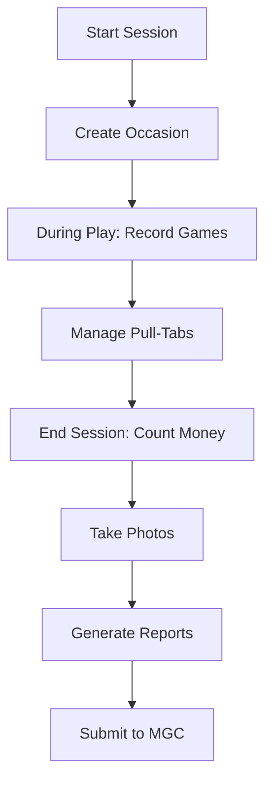

# RLC Bingo Manager - User Manual
*Version 9.0 - Complete PWA System*

## Table of Contents
1. [Introduction](#introduction)
2. [Getting Started](#getting-started)
3. [System Overview](#system-overview)
4. [Daily Operations](#daily-operations)
5. [Data Entry Procedures](#data-entry-procedures)
6. [Offline Operations](#offline-operations)
7. [Reports and Compliance](#reports-and-compliance)
8. [Troubleshooting](#troubleshooting)
9. [Reference Guide](#reference-guide)

---

## 1. Introduction

### Purpose
The RLC Bingo Manager is a complete Progressive Web Application (PWA) designed specifically for the Rolla Lions Club to manage bingo occasions in compliance with Missouri Gaming Commission (MGC) regulations. This system replaces paper-based recording with a digital solution that works both online and offline.

### Key Features
- ✅ **Offline-First Design**: Full functionality without internet connection
- ✅ **MGC Compliance**: Built-in Missouri Gaming Commission reporting
- ✅ **Photo Documentation**: Capture winner photos and receipts
- ✅ **Automatic Calculations**: Real-time totals and variance tracking
- ✅ **Cloud Sync**: Automatic synchronization when online
- ✅ **Mobile Optimized**: Works on phones, tablets, and computers
- ✅ **Secure Access**: Role-based user authentication

### User Roles

| Role | Permissions | Typical User |
|------|------------|--------------|
| **Closet Worker** | Data entry, occasion management, photo capture | Session volunteers |
| **Manager** | All worker permissions + reports, audit logs | Bingo chairperson |
| **Administrator** | Full system access + user management | IT coordinator |

---

## 2. Getting Started

### System Requirements
- **Device**: Any modern smartphone, tablet, or computer
- **Browser**: Chrome (recommended), Safari, Firefox, or Edge
- **Storage**: Minimum 100MB available storage for offline data
- **Camera**: Device camera for photo documentation (optional)

### Initial Setup

#### Step 1: Access the Application
1. Open your web browser
2. Navigate to: `https://[your-deployment-url].github.io/rlc-bingo-manager/`
3. Bookmark the page for easy access

#### Step 2: Install as App (Recommended)
**On Mobile (iOS/Android):**
1. Tap the share button in your browser
2. Select "Add to Home Screen"
3. Name it "RLC Bingo"
4. The app icon will appear on your home screen

**On Desktop (Chrome):**
1. Click the install icon (⊕) in the address bar
2. Click "Install"
3. The app will open in its own window

#### Step 3: Login
1. Enter your username and password
2. Click "Login"
3. Your credentials will be remembered for 30 days

### First-Time Configuration
Default credentials:
- Username: `admin`
- Password: `admin123`

**IMPORTANT**: Change the admin password immediately after first login.

---

## 3. System Overview

### Navigation

The application uses a tab-based navigation system with six main sections:

| Tab | Icon | Purpose |
|-----|------|---------|
| **Occasion** | 📅 | Record event details and attendance |
| **Games** | 🎮 | Track individual game winners and prizes |
| **Pull-Tabs** | 🎟️ | Manage pull-tab inventory and sales |
| **Money** | 💵 | Count cash and record deposits |
| **Photos** | 📸 | Document winners and receipts |
| **Reports** | 📊 | Generate MGC forms and analytics |

### Status Indicators

#### Connection Status
- **🟢 Online**: Data syncs automatically
- **🔴 Offline**: Data saved locally, will sync when reconnected

#### Sync Status
- **✓ Synced**: All data uploaded to cloud
- **⏳ Pending**: Data waiting to sync
- **⚠️ Error**: Sync issue requiring attention

---

## 4. Daily Operations

### Pre-Session Checklist
- [ ] Verify internet connection (optional but recommended)
- [ ] Login to the system
- [ ] Check progressive jackpot amount from previous session
- [ ] Prepare starting bank ($500 standard)
- [ ] Have camera ready for winner photos

### Session Workflow



### Post-Session Tasks
1. Verify all data is complete
2. Ensure photos are uploaded
3. Generate MGC Form 104
4. Print reports for filing
5. Confirm sync status is green

---

## 5. Data Entry Procedures

### 5.1 Occasion Tab

The Occasion tab captures the main event information required for MGC compliance.

#### Required Fields

| Field | Description | Example |
|-------|-------------|---------|
| **Date** | Date of the bingo session | 01/15/2025 |
| **Session Type** | Monday schedule code | 5-1 (1st/5th Monday) |
| **Lion in Charge** | Primary responsible member | John Smith |
| **Total Players** | Attendance count | 147 |

#### Session Types Explained
- **5-1**: 1st and 5th Mondays (when applicable)
- **6-2**: 2nd Monday
- **7-3**: 3rd Monday
- **8-4**: 4th Monday

Each session type has a predefined set of 17 games with specific prizes.

#### Progressive Game Fields

| Field | Description | Default |
|-------|-------------|---------|
| **Starting Jackpot** | Current progressive amount | Previous + increment |
| **Balls to Win** | Required balls for jackpot | 48 |
| **Consolation Prize** | Amount if not won in required balls | $200 |
| **Actual Balls Called** | Balls when won (if applicable) | Enter if won |

**Progressive Rules:**
- Jackpot increases by $100 each session if not won
- If won in ≤48 balls: Pay full jackpot
- If won in >48 balls: Pay $200 consolation
- Reset to $1,000 seed after jackpot win

### 5.2 Games Tab

The Games tab displays all 17 games for the selected session type.

#### Game Entry Process

1. **For Each Game Played:**
   - Enter number of winners (default: 0)
   - System calculates total payout automatically
   - Optional: Enter winner name/table number
   - Optional: Record balls called

2. **Special Games:**
   - **Game #9 (Event)**: Variable prize - enter manually
   - **Game #13 (Progressive)**: Links to occasion progressive data

#### Color-Coded Game Cards

| Color | Games | Typical Prize |
|-------|-------|---------------|
| Early Bird | 1-3 | $100 |
| Blue/Orange/Green/Yellow/Pink | 4-8 | $100-250 |
| Gray/Olive/Brown | 10-12 | $150 |
| Red/Purple/Black | 14-16 | $150 |
| Aqua | 17 | $500 (Coverall) |

### 5.3 Pull-Tabs Tab

Pull-tabs are instant-win games sold during the session.

#### Adding a Pull-Tab Game

1. Click **"Add Pull-Tab Game"**
2. Enter game information:
   - **Game Name**: From the ticket display
   - **Serial Number**: Located on the flare
   - **Price per Tab**: Usually $0.25, $0.50, or $1.00
   - **Starting Count**: Number of tabs at start
   - **Ending Count**: Number of tabs remaining

3. System calculates automatically:
   - Tabs Sold = Starting - Ending
   - Gross Sales = Tabs Sold × Price
   - Net Revenue = Gross Sales - Prizes Paid

#### Recording Prize Winners
1. Enter total prizes paid out
2. Click "Add Prize Entry" for each winner
3. Record amount and winner information
4. System updates net revenue automatically

#### Pull-Tab Best Practices
- Count remaining tabs immediately after session
- Record all prize payouts as they occur
- Keep serial numbers for state reporting
- Verify calculations match cash on hand

### 5.4 Money Count Tab

Accurate money counting is critical for balancing and deposits.

#### Denomination Count

Count and enter quantities for each denomination:

| Bills | Coins |
|-------|-------|
| $100 | Quarters |
| $50 | Dimes |
| $20 | Nickels |
| $10 | Pennies |
| $5 | |
| $1 | |

The system calculates subtotals and grand total automatically.

#### Check Recording

For each check received:
1. Click **"Add Check"**
2. Enter:
   - Check number
   - Payer name
   - Amount
3. System adds to total deposit

#### Verification Process

1. **Starting Bank**: Enter amount (usually $500)
2. **Expected Revenue**: Enter anticipated total
3. **System Calculates**:
   - Total Cash + Checks
   - Less Starting Bank = Deposit Amount
   - Variance from Expected

**Variance Indicators:**
- 🟢 Green: Within $1 (acceptable)
- 🟡 Yellow: $1-10 difference (review)
- 🔴 Red: Over $10 difference (investigate)

#### Count Verification
- **Counted By**: Person who performed count
- **Verified By**: Second person who verified

### 5.5 Photos Tab

Photo documentation provides visual records for compliance and disputes.

#### What to Photograph
- ✅ Large prize winners (over $100)
- ✅ Progressive game winners
- ✅ Unusual payouts or disputes
- ✅ Completed pull-tab flares
- ✅ Check payments
- ✅ End-of-night money count sheets

#### Taking Photos
1. Click the camera area or "Click to upload photos"
2. Choose:
   - **Take Photo**: Use device camera
   - **Choose File**: Select existing photo
3. Photos are automatically:
   - Compressed for storage
   - Tagged with occasion ID
   - Queued for cloud upload

#### Photo Tips
- Ensure good lighting
- Include faces for winner photos
- Make text/numbers clearly readable
- Take multiple angles if needed
- Photos sync when online

### 5.6 Reports Tab

Generate required reports and forms for compliance.

#### Available Reports

| Report | Purpose | Format |
|--------|---------|--------|
| **MGC Form 104** | Missouri Gaming Commission required filing | PDF |
| **Session Summary** | Internal records and accounting | PDF |
| **Detailed Games Report** | Individual game analysis | PDF/Excel |
| **Pull-Tab Inventory** | Track pull-tab sales and profits | Excel |
| **Monthly Summary** | Board reporting | PDF |

#### Generating MGC Form 104

1. Ensure all data is complete:
   - Occasion details filled
   - Games recorded
   - Money counted
   - Pull-tabs entered

2. Click **"Generate MGC Form 104"**
3. Review generated form for accuracy
4. Click **"Download PDF"**
5. Print and file as required

#### Report Distribution
- **MGC Copy**: Submit as required by regulations
- **Club Copy**: File with treasurer
- **Backup Copy**: Store in secure location

---

## 6. Offline Operations

### How Offline Mode Works

The system is designed to work without internet connection:

1. **Automatic Detection**: System detects connection loss
2. **Local Storage**: All data saved to device storage
3. **Queue System**: Changes tracked for later sync
4. **Visual Indicators**: Red offline status shown
5. **Auto-Sync**: Data uploads when reconnected

### Offline Capabilities

✅ **Full Functionality Available Offline:**
- Create and edit occasions
- Record all game data
- Manage pull-tabs
- Count money
- Generate reports (except cloud features)

⚠️ **Limited Offline:**
- Photo uploads (queued for sync)
- Historical data access (cached only)
- Multi-device synchronization

❌ **Requires Connection:**
- Initial login
- User management
- Downloading updates

### Best Practices for Offline Use

1. **Before Going Offline:**
   - Login while connected
   - Let app fully load
   - Verify offline indicator works

2. **During Offline Use:**
   - Continue normal operations
   - Note the offline indicator
   - Save frequently (automatic)

3. **After Reconnecting:**
   - Wait for sync to complete
   - Verify green sync status
   - Check for conflicts

### Data Sync Process

```
Offline Changes → Local Queue → Connection Restored → 
Auto-Sync → Server Validation → Confirmation → ✓ Synced
```

### Handling Sync Conflicts

If the same record was edited on multiple devices:
1. System shows conflict alert
2. Review both versions
3. Choose which to keep
4. Manually merge if needed

---

## 7. Reports and Compliance

### Missouri Gaming Commission Requirements

#### MGC Form 104 - Occasion Report

**Required Information:**
- Organization name and license number
- Date and location of occasion
- Attendance figures
- Detailed prize payouts
- Gross receipts and net proceeds
- Responsible party signatures

**Submission Timeline:**
- Monthly: Compile all occasion reports
- Quarterly: Submit summary to MGC
- Annual: Complete comprehensive report

#### Record Retention

| Document Type | Retention Period |
|--------------|------------------|
| MGC Forms | 3 years |
| Financial Records | 7 years |
| Winner Photos | 1 year |
| Dispute Documentation | 3 years |

### Internal Reports

#### Session Summary Report
Provides complete overview of single occasion:
- Attendance and demographics
- Game-by-game prize analysis
- Pull-tab performance
- Financial reconciliation
- Variance explanations

#### Monthly Operations Report
Aggregates all sessions for the month:
- Total attendance trends
- Revenue analysis
- Prize payout ratios
- Progressive game status
- Operational insights

#### Annual Analytics
Year-end comprehensive analysis:
- Seasonal patterns
- Game popularity metrics
- Volunteer performance
- Profit trends
- Recommendations

### Generating Custom Reports

1. Navigate to Reports tab
2. Select report type
3. Choose date range
4. Apply filters (optional):
   - Session type
   - Specific games
   - Prize ranges
5. Click "Generate"
6. Export as PDF or Excel

---

## 8. Troubleshooting

### Common Issues and Solutions

#### Login Problems

| Issue | Solution |
|-------|----------|
| Forgot password | Contact administrator for reset |
| Account locked | Wait 15 minutes or contact admin |
| "Invalid credentials" | Check caps lock, verify username |

#### Sync Issues

| Issue | Solution |
|-------|----------|
| Stuck on "Syncing..." | Check internet connection, refresh page |
| "Sync failed" error | Click retry, check for app updates |
| Missing data after sync | Check filters, verify date range |

#### Data Entry Errors

| Issue | Solution |
|-------|----------|
| Can't save occasion | Verify all required fields completed |
| Wrong session games | Check session type selection |
| Money count doesn't balance | Recount, check for entry errors |

#### App Performance

| Issue | Solution |
|-------|----------|
| App running slowly | Clear browser cache, restart device |
| Buttons not responding | Check internet connection, refresh |
| Photos won't upload | Verify file size <5MB, check format |

### Error Messages

#### "Network Error"
- **Cause**: No internet connection
- **Solution**: Continue in offline mode, data will sync later

#### "Session Expired"
- **Cause**: Logged in too long
- **Solution**: Log out and back in

#### "Insufficient Storage"
- **Cause**: Device storage full
- **Solution**: Clear old data, free up space

#### "Validation Error"
- **Cause**: Invalid data entered
- **Solution**: Check highlighted fields, correct errors

### Getting Help

#### Support Channels

1. **Immediate Help**:
   - In-app help button
   - Context-sensitive tips
   - Validation messages

2. **Administrator Support**:
   - Contact: [admin email]
   - Phone: [support number]
   - Hours: [availability]

3. **Technical Support**:
   - Email: support@rlcbingo.org
   - Documentation: [docs URL]

---

## 9. Reference Guide

### Quick Reference Card

#### Session Start
1. Login → Occasion tab
2. Enter date, type, lion in charge
3. Record attendance
4. Note progressive jackpot
5. Save occasion

#### During Session
1. Games tab → Enter winners
2. Pull-tabs → Track sales
3. Photos → Capture winners
4. Save frequently

#### Session End
1. Money tab → Count all cash
2. Record checks
3. Verify totals
4. Generate reports
5. Confirm sync

### Data Field Reference

#### Occasion Fields

| Field | Type | Required | Validation |
|-------|------|----------|------------|
| Date | Date | Yes | Not future date |
| Session Type | Select | Yes | 5-1, 6-2, 7-3, 8-4 |
| Lion in Charge | Text | Yes | 2-50 characters |
| Total Players | Number | Yes | 0-500 |
| Workers Count | Number | No | 0-50 |
| Start Time | Time | No | Valid time |
| End Time | Time | No | After start time |

#### Progressive Game Rules

| Balls Called | Action | Payout |
|--------------|--------|--------|
| ≤48 | Jackpot Won | Full progressive amount |
| >48 | Consolation | $200 |
| Not won | Carry over | Add $100 for next session |

### Keyboard Shortcuts

| Shortcut | Action |
|----------|--------|
| Tab | Next field |
| Shift+Tab | Previous field |
| Enter | Submit form |
| Esc | Cancel dialog |
| Ctrl+S | Save current form |
| Ctrl+P | Print report |

### Session Type Game Configurations

#### 5-1 Schedule (1st/5th Monday)
1. Hard Way Bingo - $100
2. Diagonal & Corners - $100
3. Small Picture Frame - $100
4. Block of 9 - $100
5. $250 Number 7 - $250
6. Small Diamond - $100
7. Razor Blade - $100
8. $250 Letter X - $250
9. Special Event - Variable
10. 5 Around Corner - $150
11. Double Postage - $150
12. Outside Line - $150
13. Progressive Diamond - Progressive
14. Checkmark - $150
15. Regular Bingo - $150
16. 3 Top & Bottom - $150
17. $500 Coverall - $500

*(Similar configurations for 6-2, 7-3, and 8-4 schedules)*

### Glossary

| Term | Definition |
|------|------------|
| **Occasion** | Single bingo session/event |
| **Session Type** | Monday schedule determining games |
| **Progressive** | Jackpot that grows until won |
| **Consolation** | Reduced prize for late win |
| **Pull-Tab** | Instant-win paper game |
| **Flare** | Pull-tab display showing prizes |
| **MGC** | Missouri Gaming Commission |
| **Variance** | Difference between expected and actual |
| **Sync** | Upload local data to cloud |

---

## Appendices

### Appendix A: MGC Compliance Checklist

- [ ] Licensed organization displayed
- [ ] License number on all reports
- [ ] Occasion reports filed monthly
- [ ] Prize limits not exceeded
- [ ] Proper record retention
- [ ] Annual report submitted
- [ ] Taxes filed quarterly

### Appendix B: Emergency Procedures

**Power Failure During Session:**
1. Switch to paper backup forms
2. Record all transactions manually
3. Enter into system when power restored
4. Note incident in occasion notes

**System Failure:**
1. Try different device/browser
2. Use offline mode if possible
3. Contact technical support
4. Use paper backup as last resort

**Data Loss:**
1. Check offline storage
2. Contact administrator
3. Restore from last backup
4. Re-enter missing data

### Appendix C: Training Materials

**New User Training Checklist:**
- [ ] System overview
- [ ] Login procedures
- [ ] Navigation basics
- [ ] Occasion creation
- [ ] Game recording
- [ ] Money counting
- [ ] Report generation
- [ ] Offline operations
- [ ] Troubleshooting

**Training Resources:**
- Video tutorials: [URL]
- Practice environment: [URL]
- Quick start guide: [URL]
- FAQ document: [URL]

---

## Document Information

**Version**: 9.0  
**Last Updated**: January 2025  
**Author**: RLC Bingo System Team  
**Contact**: support@rlcbingo.org  

© 2025 Rolla Lions Club. All rights reserved.

This manual is proprietary to the Rolla Lions Club and contains confidential information. Unauthorized distribution is prohibited.